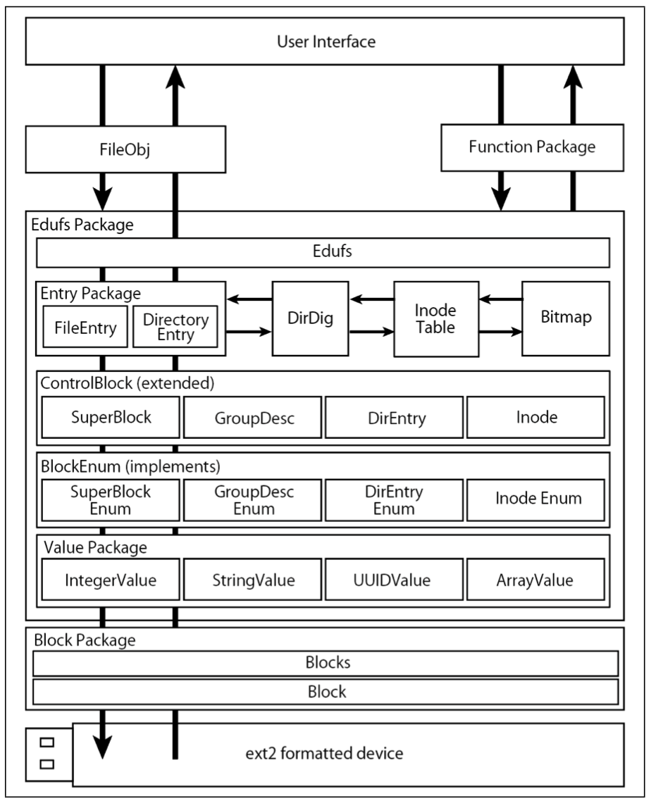

# edufs

<!--
### Background
The scope of computer use and technology is expanding.

The OS (Operating System) embedded in these computers is important, and OS education will continue to be important in the future as its use expands. 

Current OS education can be divided into two categories: "basic education" to understand the external specifications of the OS using system calls, etc., and "principle education" to understand the OS mechanism from its internal structure.

### Problem in "Principle Education"

There is a problem with the textbook-based class on the OS mechanism, which is an educational method in principles education. 

First of all, it is difficult to get a real sense of the OS mechanism even if one reads it in order, and it is hard to imagine how it actually works. In the first place, there are few textbooks, and some of them are old. Therefore, there is a limitation in textbook-based learning.

It is also difficult to create OS functions in the class because there is not enough time and technology to implement them in one semester.
-->

edufs is a file system for teaching materials created in Java language. edufs has the following features.

### Use Java lang

edufs uses the Java language, which is a high-level language. This means that The purpose is to make it easier for the learner to understand programming using an object-oriented approach.

### Application Program

edufs runs as an application program independent of OS-related processes. Originally, filesystems need to be included either statically in the kernel image and recognized at kernel compile time, or dynamically as a module. If you want to implement a new file system, you need to register the file system type. Even for a single file system, the knowledge and time required of learners are not small, and it is extremely difficult to implement a file system within a semester. For this reason, we have chosen a format that can be completed only with the source code in a single project, without any registration work. This allows us to implement the system by considering only reading and writing files in edufs.

### Simple Architecture

edufs can only input and output files. A file system has various functions other than file input/output. For example, there is the `fsck` command, which inspects and repairs the file system. However, since ease of understanding is important for practical learning, we have kept the functions as simple as possible and omitted those we judged to be unnecessary.

### Per-package/per-class behavior

edufs allows packages and some classes to run by themselves. This makes it possible to follow the program in turn and obtain the execution results for each component, which leads to easier understanding of the program.

### Architecture
</img>
```
FileObj           File object
Function          Package Function package that uses edufs Edufs Class that accepts requests from users
Entry Package     File entries in edufs
DirDig            Class for file traversal
InodeTable        inode table
Bitmap            Bitmap
ControlBlock      Class for handling ext2 groups
Value Package     A structure for group values in BlockEnum ext2 that processes byte strings into appropriate values
Block Package     Reads in blocks
```
